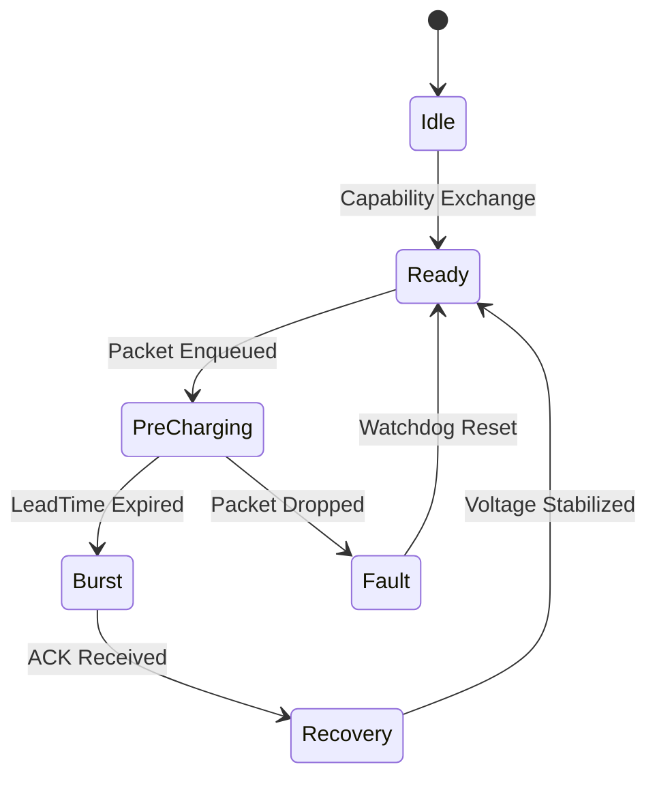

# AI Power Protocol (AIPP) Standard Specification
## Version 1.0 (The "Grid-to-Gate" Architecture)

---

## 1. Executive Summary
The **AI Power Protocol (AIPP)** is a formal cross-layer communication standard designed to synchronize high-performance network fabric with sub-microsecond power transients in AI accelerators. 

AIPP enables a **$1 Billion System Architecture** by shifting power management from reactive hardware loops to predictive, network-orchestrated scheduling.

---

## 2. Handshake Protocol (Phase 1: Discovery & Verification)
Before data transmission, the Network Switch and Compute Node MUST exchange capabilities and establish a **Zero-Trust Trust Anchor**.

| Parameter | Identifier | Description |
|-----------|------------|-------------|
| `LeadTime_Min` | `0x01` | Minimum lead time (ns) required by VRM to ramp current. |
| `Boost_Cap` | `0x02` | Maximum voltage boost (mV) allowed before OVP. |
| `HBM_Sync` | `0x03` | Support for DPLL phase-locked memory refresh pulses. |
| `Load_Verify` | `0x04` | Requirement for local NIC to authorize voltage boost upon packet start. |
| `Workload_Intent` | `0x05` | Support for libAIPP software intent signaling. |
| `Fabric_Token` | `0x06` | Support for spine-leaf power token arbitration. |

---

## 3. Timing & Synchronization (The "Temporal Nervous System")

### 3.1 Global Heartbeat Broadcast
To overcome the Speed of Light (15ns per 3 meters), AIPP utilizes a **Global Heartbeat** mechanism.
1.  **Switch Role:** Broadcasts a 100Hz PTP-synchronized heartbeat signal.
2.  **Node Role:** GPU Memory Controller utilizes a local **DPLL** to phase-lock HBM4 refresh cycles to the heartbeat's "Quiet Valleys."
3.  **Accuracy:** Deterministic alignment to < 1ns across 100-meter cluster radius.

### 3.2 libAIPP Software SDK
The **libAIPP SDK** allows high-level software (PyTorch, JAX) to inject power intent directly into the fabric.
- **Trigger:** `model.forward()` or `kernel_launch()`.
- **Packet:** 5us pre-launch "Intent Signal" sent to switch via RoCE/UDP.
- **Benefit:** Eliminates the "Trigger Uncertainty" window by providing ground-truth intent from the code itself.

---

## 3. Signaling & Packet Formats (Phase 2)

### 3.1 The AIPP "Wake-Up" Control Frame
A high-priority L2 frame sent from the Switch to the Node.

| Bits | Field | Description |
|------|-------|-------------|
| 0-7 | `OpCode` | `0x10`: Pre-Charge Request |
| 8-23 | `LeadTime` | Lead time in nanoseconds. |
| 24-39 | `Amplitude` | Boost voltage amplitude in millivolts. |
| 40-103 | `Timestamp` | PTP Timestamp for deterministic execution. |

**Transport Policy:** AIPP frames MUST utilize **IEEE 802.3br (Express Traffic)** or **PCIe VDM** to guarantee sub-microsecond delivery regardless of background network congestion. Use of legacy I2C or SMBus is strictly prohibited for sub-microsecond pre-charge signaling.

### 3.2 The In-Band Telemetry Header (AIPP-IB)
Embedded in the IPv6 Flow Label or TCP Option 0x1A.

```text
+--------+--------+--------+--------+
| V_Health | S_Rate | Resv   | CRC8   |
| (4 bits) | (4 bits)| (4 bits)| (4 bits)|
+--------+--------+--------+--------+
```

### 3.3 The Unified Temporal Policy Frame (TPF)
To ensure system-wide deterministic orchestration, the Switch broadcasts a **128-bit Temporal Policy Frame (TPF)** every 100µs. This frame acts as the "Conductor's Baton" for the entire fabric.

| Bits | Field | Description |
|------|-------|-------------|
| 0-31 | `Voltage_Setpoint` | Global feed-forward target for VRM pre-charging (mV). |
| 32-63 | `Memory_Credits` | Temporal credit allocation for HBM4/CXL prefetching. |
| 64-95 | `Quorum_Signature` | Hardware-signed trust token for secure compute authorization. |
| 96-127| `Jitter_Seed` | Stochastic seed for signature whitening and security masking. |

---

## 4. State Machines (Phase 3: Fault Handling)

### 4.1 Switch Scheduler State Machine


### 4.2 VRM Watchdog Failsafe
AIPP-compliant VRMs MUST implement a hardware watchdog timer.
1. **Trigger:** Upon receipt of "Wake-Up" frame, start timer `T_safe`.
2. **Detection:** If packet `Seq_ID` not detected within `T_safe`.
3. **Action:** Autonomous ramp-down to `V_nominal` in < 500ns.

---

## 5. Timing Requirements (PTP Synchronization)
AIPP requires PTP (IEEE 1588v2) synchronization between all endpoints.
- **Max Clock Drift:** < 1 microsecond ($\mu s$).
- **Deterministic Sync:** Signals MUST use future timestamps to overcome network jitter.

---

## 6. Implementation Scenarios
1. **Model Synchronization:** Aligning HBM4 refresh with network quiet windows.
2. **Chiplet Migration:** Moving power via UCIe in < 10ns.
3. **Grid VPP:** Providing city-scale synthetic inertia via cluster jitter.
4. **Optical Bias:** Pre-heating lasers 100us before data bursts to prevent BER.
5. **Storage Incast:** Staggering checkpoint arrival to flatten 50MW surges.

---

## 7. Temporal Policy Broadcasting (The Conductor Model)
To ensure system-wide stability without global "God-Box" complexity, the Switch MUST broadcast a **Temporal Policy Frame** every 100µs.

- **Policy ID 0x01 (High Transient):** All local controllers (SSD, Laser, HBM) MUST prioritize voltage stability over peak performance.
- **Policy ID 0x02 (Nominal):** Local controllers may optimize for throughput and efficiency.
- **Sovereignty:** Local hardware watchdogs ALWAYS override Switch signals if local safety limits (OVP/OTP) are reached.

---

**© 2025 Neural Harris IP Holdings. All Rights Reserved.**  
*Confidential — For Evaluation by Strategic Acquirers Only.*

