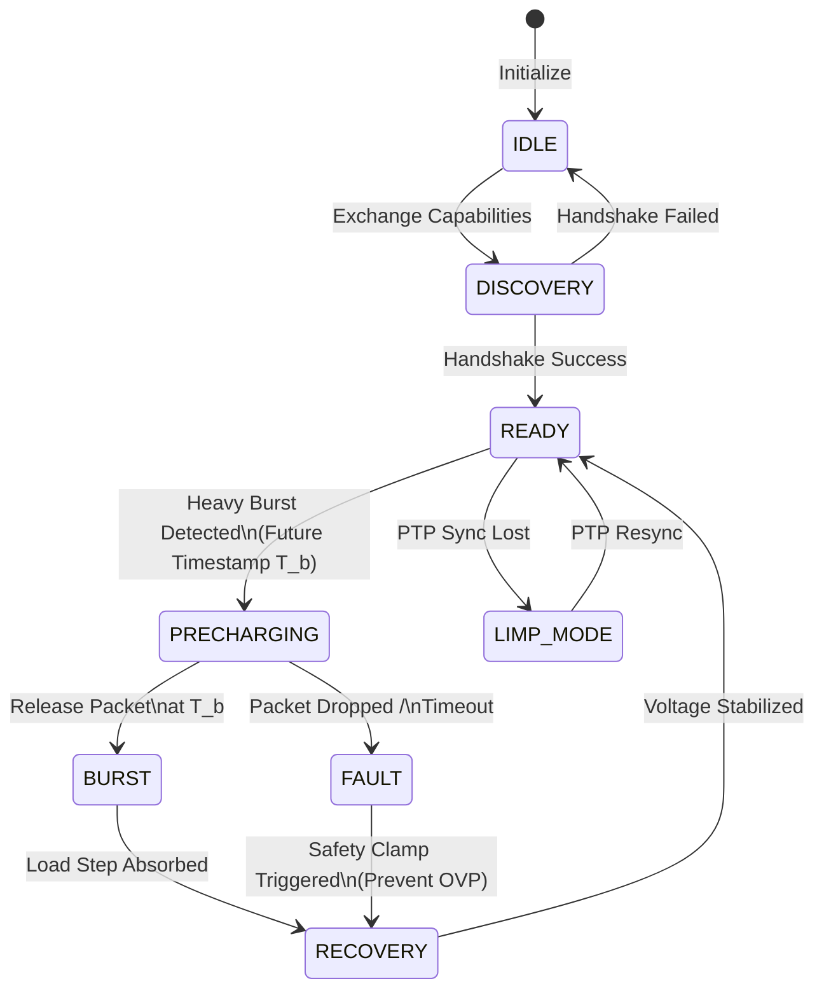

# Grid-to-Gate Power Orchestration Protocol (GPOP)
## Technical Standard Specification v1.0

This document defines the interoperability requirements for the **Grid-to-Gate Power Orchestration Protocol (GPOP)**. GPOP enables nanosecond-scale coordination between network switching silicon and compute-node power delivery systems (VRMs).

---

## 1. Protocol Architecture

GPOP operates as a cross-layer synchronization plane between the **Network Transport Layer** and the **Physical Power Plane**.

### 1.1 Protocol State Machine

The following state machine governs the interaction between a GPOP-compliant Switch and a GPOP-compliant VRM.



---

## 2. Handshake & Discovery (Phase 1)

Before orchestration begins, the Switch and GPU must negotiate capabilities via an out-of-band management channel or a designated discovery frame.

| Parameter | Type | Description |
|-----------|------|-------------|
| `PreCharge_Lead_Time_Min` | uint16 (ns) | Minimum lead time required by VRM. |
| `PreCharge_Lead_Time_Max` | uint16 (ns) | Maximum hold time before OVP risk. |
| `Boost_Amplitude_Max` | uint16 (mV) | Maximum allowable V_preboost. |
| `PTP_Sync_Required` | boolean | Requirement for nanosecond clock sync. |

---

## 3. Signaling & Packet Formats (Phase 2)

### 3.1 The GPOP "Wake-Up" Control Frame

This is a high-priority, ultra-low-latency frame sent from the Switch to the VRM. It MUST be processed in the VRM fast-path.

| Field | Bits | Description |
|-------|------|-------------|
| `OpCode` | 8 | `0x01`: Wake-Up |
| `Scheduled_Arrival` | 64 | PTP Timestamp of expected load step. |
| `Target_Amplitude` | 16 | Requested boost level (encoded in mV). |
| `Duration` | 16 | Expected duration of compute burst (ns). |
| `Flow_ID` | 32 | Identifier for the causing flow. |

### 3.2 The In-Band Telemetry Header (IPv6 Option)

GPOP utilizes the IPv6 Flow Label (or a custom Option Kind 0x1A) to carry real-time rail health.

```text
0                   1                   2                   3
0 1 2 3 4 5 6 7 8 9 0 1 2 3 4 5 6 7 8 9 0 1 2 3 4 5 6 7 8 9 0 1
+-+-+-+-+-+-+-+-+-+-+-+-+-+-+-+-+-+-+-+-+-+-+-+-+-+-+-+-+-+-+-+-+
| Option Kind   | Option Length | V_Health (4b) | Slew_Rate (4b)|
+-+-+-+-+-+-+-+-+-+-+-+-+-+-+-+-+-+-+-+-+-+-+-+-+-+-+-+-+-+-+-+-+
```

*   **V_Health:** Quantized voltage margin (0=Worst, 15=Nominal).
*   **Slew_Rate:** $dv/dt$ indicator for gradient preemption.

---

## 4. Timing & Synchronization (Phase 3)

### 4.1 PTP Integration

GPOP requires PTP (IEEE 1588v2) synchronization between the Switch and the GPU. 

*   **Future Timestamping:** The "Wake-Up" frame carries a future timestamp $T_{arrival}$ rather than a trigger bit. This ensures robustness against network jitter in the control plane.
*   **Lead Time Constraint:** $T_{trigger} = T_{arrival} - T_{lead}$.
*   **Safety Bound:** If $|T_{now} - T_{arrival}| > \epsilon$, the VRM enters **Safety Clamp** mode.

---

## 5. Fault Handling & Safety (The "Insurance")

### 5.1 The Safety Clamp (OVP Protection)

If the Switch triggers a pre-charge boost but the compute packet is dropped or delayed beyond the `Hold_Time_Max`, the VRM must autonomously ramp down the voltage to prevent an Over-Voltage (OVP) event.

1.  **Detection:** VRM timer exceeds $T_{expected} + \delta$.
2.  **Action:** Inhibit boost, return to nominal via controlled discharge.
3.  **Reporting:** Log "Orchestration Miss" to management plane.

### 5.2 Limp Mode

If the PTP clock drift exceeds $1\mu s$, GPOP is automatically disabled. The Switch falls back to **Binary Shedding** and **Static Throttling** to ensure basic safety without precision timing.

---

## 6. Implementation Guidelines

### 6.1 Switch Hardware (ASIC)
*   **Parser:** Must support line-rate extraction of 4-bit health codes.
*   **Scheduler:** Must support per-packet delay buffers with nanosecond granularity.

### 6.2 VRM Controller
*   **Interface:** Must support PCIe VDM or a dedicated LVDS pin for GPOP signals. Legacy I2C/SMBus are prohibited for sub-microsecond signaling.
*   **Slew Rate:** Must support programmed $dV/dt$ ramps for pre-charge.


